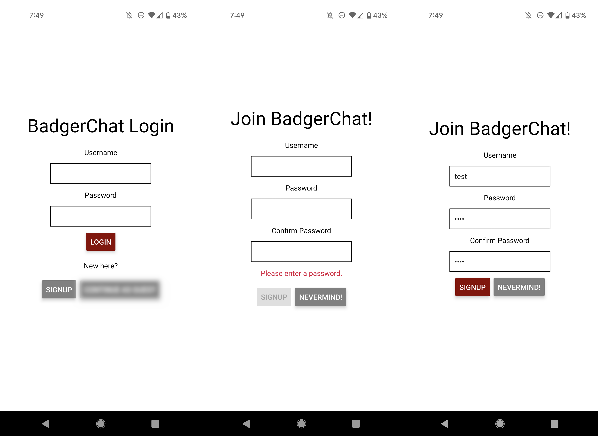
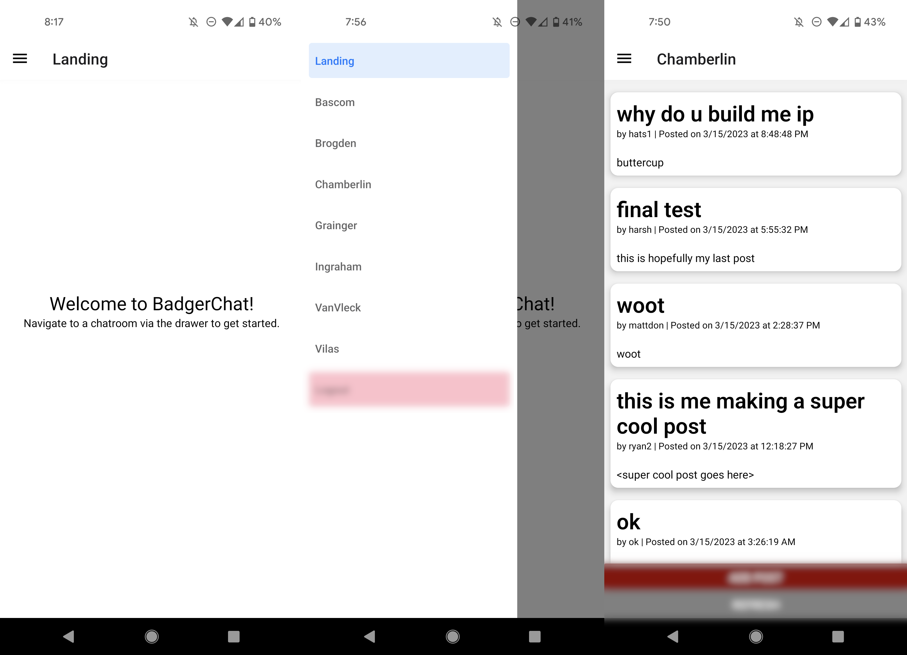
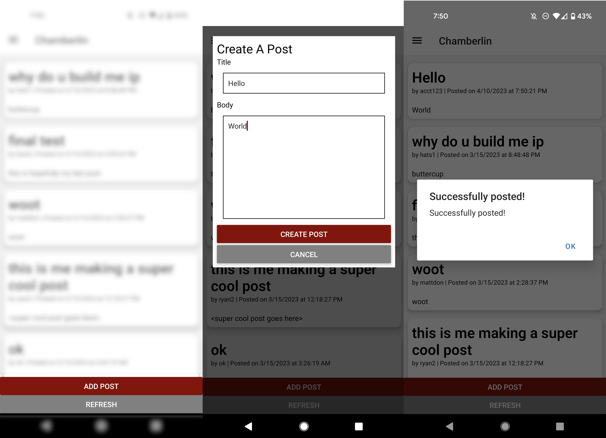
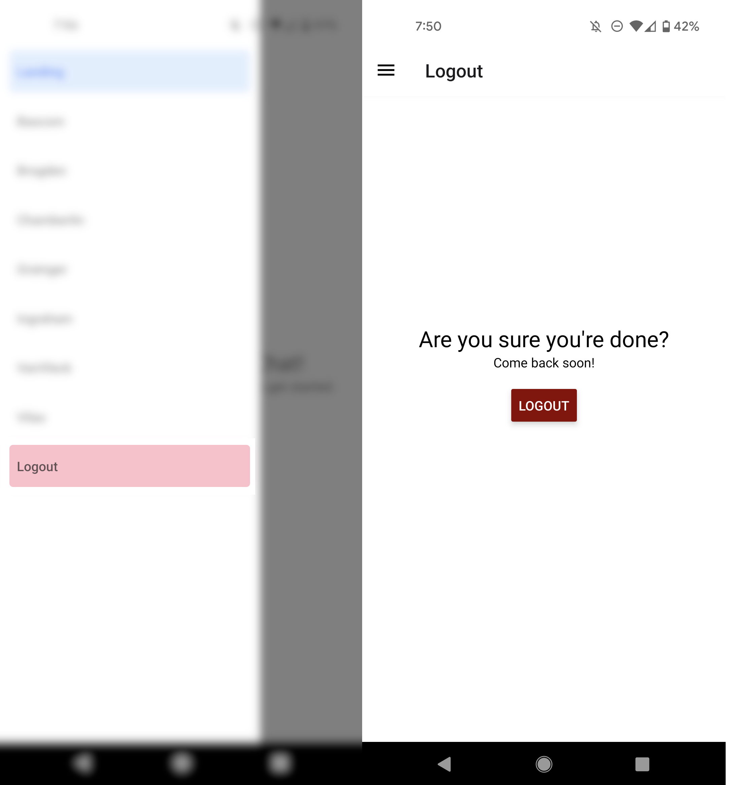
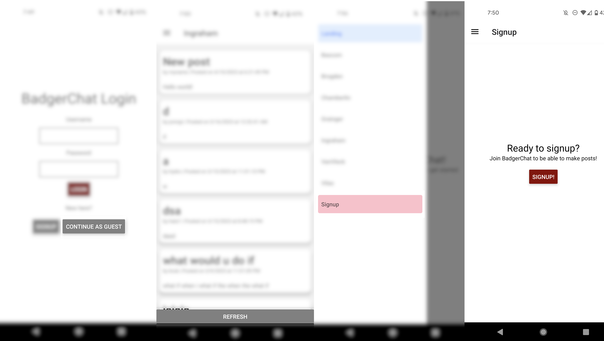

[](https://classroom.github.com/online_ide?assignment_repo_id=10882372&assignment_repo_type=AssignmentRepo)

# CS571-S23 HW10: BadgerChat

Welcome back to BadgerChat! For this assignment, you will re-implement BadgerChat as *a mobile application*. **There is no design aspect of this assignment.**

## BadgerChat

The starter code provided to you was generated using [expo](https://expo.dev/) and all the necessary libraries for [react navigation](https://reactnavigation.org/) and [expo-secure-store](https://www.npmjs.com/package/expo-secure-store) have already been added. See the `package.json` for details. **You should *not* re-run the expo init command**. Instead, in this directory, simply run...

```bash
npm install
npm start
```

To test your app, you have a few options. If you have a smart device, I would recommend using the expo app for [iOS](https://apps.apple.com/us/app/expo-go/id982107779) or [Android](https://play.google.com/store/apps/details?id=host.exp.exponent&hl=en_US&gl=US). You can scan the QR code using your phone, or you can launch commands via the terminal. Otherwise, you can use an emulator (such as [AVD](https://developer.android.com/studio/run/emulator)). Do not use the web browser to test your code; you must test on Android or iOS!

Note that we are writing code in JavaScript for React Native; if you begin writing code in Objective-C, Swift, Java, or Kotlin you are likely doing something *very* wrong!

### API Notes

All data can be retrieved via API calls to `https://cs571.org/s23/hw10/api/`.

 - **This API has similar endpoints to HW6.**
 - **This API shares the same database as HW6.**
 - **This API uses the `Authorization` header instead of cookies.**

A brief overview of the API is provided below. Further details can be found in `API_DOCUMENTATION.md`. All routes are relative to `https://cs571.org/s23/hw10/api/`

| Method | URL | Purpose | Return Codes |
| --- | --- | --- | --- |
| `GET`| `/chatroom` | Get all chatrooms. | 200, 304 |
| `GET` | `/chatroom/:chatroomName/messages`| Get latest 25 messages for specified chatroom. | 200, 304, 404 |
| `POST` | `/chatroom/:chatroomName/messages` | Posts a message to the specified chatroom. Requires JWT. | 200, 400, 404, 413 |
| `POST` | `/register` | Registers a user account and returns a JWT. | 200, 400, 401, 409, 413  |
| `POST` | `/login` | Logs a user in, returning a JWT. | 200, 400, 401, 404 |

**When making API calls with a request body, don't forget to include the header `"Content-Type": "application/json"`**

Starter code is provided in both `App.js` as well as the `components` folder. You may choose to use or disregard this.

### 1. Login & Register
Provide a login screen that allows the user to login with an existing username and password. Upon an incorrect password, display something along the lines of "Incorrect login, please try again."

Furthermore, provide a registration screen. This screen should allow the user to register an account with a username, password, and repeated password. A warning should be shown that says "Please enter a password" when a password is missing and "Passwords do not match" when the passwords do not match. This can either be done in real-time or upon clicking "register". Upon registration, if the username is already taken, inform the user.

The user should be able to switch back and forth between the login and registration screens using the informal "switch" navigation. Upon *either* logging in or registering, the user should be directed to the BadgerChat landing page.

**You must use expo-secure-store to store the JWT.**

**Passwords should be masked with stars,** see the [TextInput documentation](https://reactnative.dev/docs/textinput).



### 2. Display Chatrooms

After the user has successfully logged in, they should be routed to a landing page. On this landing page, the user should be able to access a drawer that will allow them to navigate to the different chatrooms of BadgerChat. Each chatroom should display the messages for that chatroom as well as the option to add a post or refresh with the latest messages.

**You must use React Navigation for this requirement.**



### 3. Create Post

The user should be able to create a post in a particular chatroom. How you choose to do this is up to you! For example, you can simply use another screen or you can use [react-native-modal](https://www.npmjs.com/package//react-native-modal) to complete your [third party library](https://canvas.wisc.edu/courses/345833/assignments/1780217) assignment. Upon posting, the user should see the *updated* message board.

**Remember:** Because the phone is not a browser, we no longer use cookies! Instead, we must manually specify the header `Authorization: Bearer <JWT>` where `<JWT>` is the token that was stored using `expo-secure-store`.



### 4. Logout

Add a navigation screen to the drawer for the user to logout. **This item should be stylistically different from the other drawer items.** Upon logout, the JWT should be deleted from the secure store and the user should be re-routed to the login screen.

**Note:** In this API, because we are no longer using cookies, there is not a logout endpoint. You just need to remove the JWT from the secure store on your device.



### 5. Anonymous Access

BadgerChat is a public forum, so users should be able to view posts without an account. Add a "Continue As Guest" option to the login screen. When continuing as guest, the user should be able to view posts, but not add a post. Furthermore, instead of logging the user out, re-route them **to the signup screen** -- we will try to [convert our guest into a user](https://seodigitalgroup.com/what-is-a-conversion/).



### Other Notes
You do not need to handle deletion of posts. You do *not* need to handle HTTP 413s from the server. You do *not* need to prompt the user to re-authenticate upon expiration of the JWT. You may *not* hardcode the names of the chatrooms *anywhere*!

You should now be able to interact with BadgerChat through both your phone and the web! 🥳

### Submission Details
In addition to your code, **you will also need to submit a video recording of your app**. Like the demo video, it should cover all the tasks below. Please thoroughly demonstrate all tasks to showcase the capabilities of your app.

**Please embed your recording as a Kaltura video as a part of the assignment submission.**

#### Tasks 
 1. Try to register for an account that already exists.
 2. Register for a new account.
 3. Logout.
 4. Login with an *incorrect* password.
 5. Login with a *correct* password.
 6. Browse two different chatrooms.
 7. Create a post and show that it has been added.
 8. Logout.
 9. Continue as a guest.
 10. Visit a chatroom.
 11. Logout (return to signup). 
